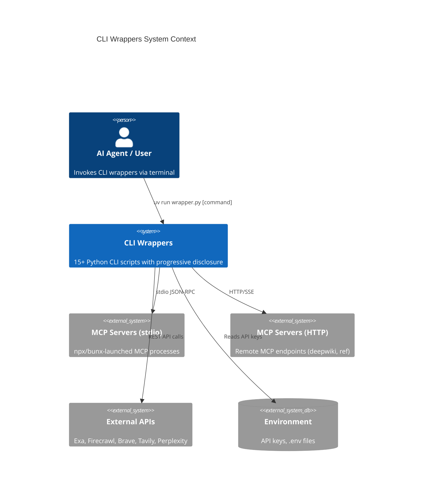
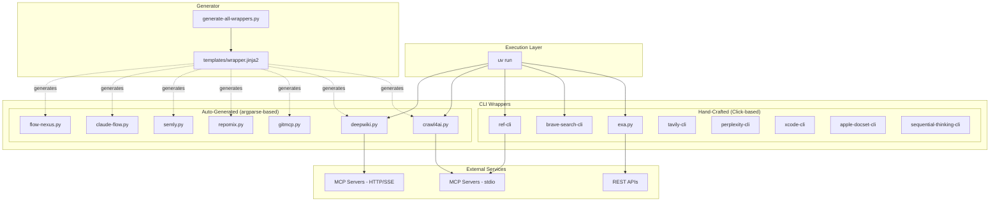
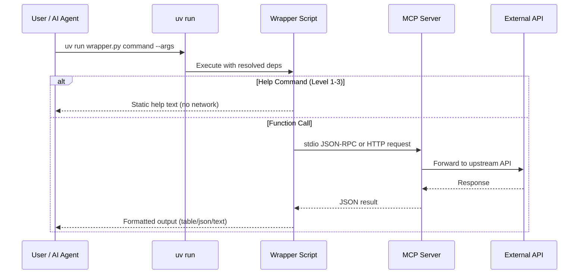
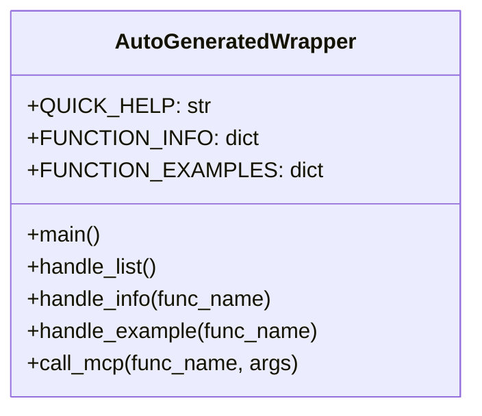
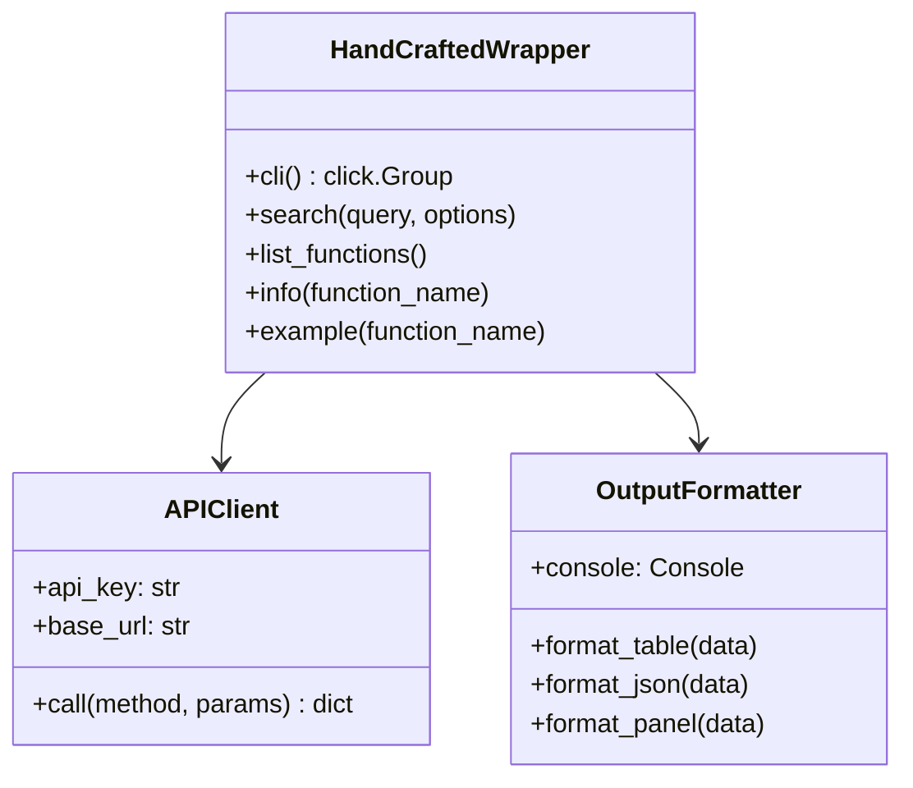
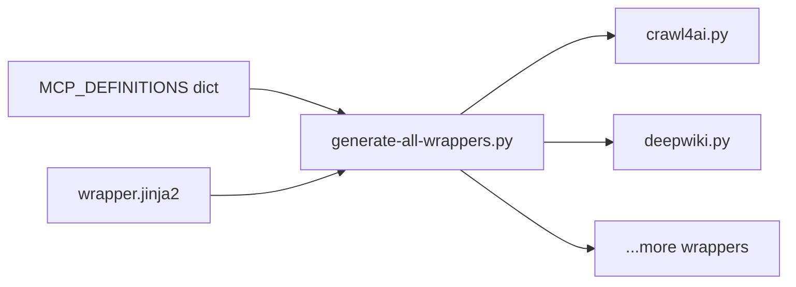
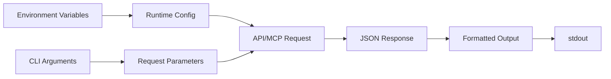
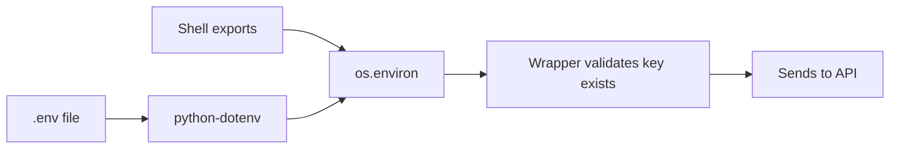
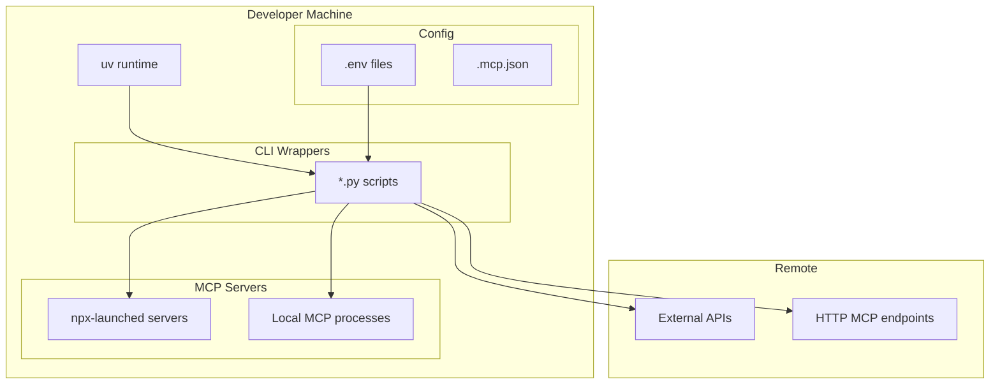
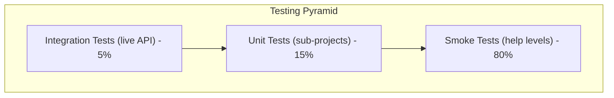

# CLI Wrappers Architecture Document

> **Status**: Approved
> **Last Updated**: 2026-03-11
> **Authors**: Bruno
> **Reviewers**: --

---

## 1. Overview

### 1.1 Purpose
CLI Wrappers is a collection of 15+ self-contained Python CLI tools that wrap Model Context Protocol (MCP) servers. Each wrapper exposes MCP functionality through a consistent 4-level progressive disclosure help system, reducing token usage by 60-70% compared to monolithic help.

### 1.2 Scope
This document covers the architecture of the CLI wrappers collection: wrapper types, execution model, data flow, integration patterns, code generation, and operational concerns. It does not cover the MCP servers themselves or the Claude Code integration layer in detail.

### 1.3 Audience
- **Primary**: Developers extending or maintaining the wrapper collection
- **Secondary**: AI agents consuming these tools, infrastructure maintainers

### 1.4 Document Conventions
- `Code` - File names, commands, environment variables
- **Bold** - Architectural decisions and key concepts
- *Italic* - Emphasis on constraints or trade-offs

---

## 2. Goals and Non-Goals

### 2.1 Goals
1. Provide token-efficient CLI access to MCP servers for AI agent consumption
2. Maintain zero-install execution via PEP 723 + `uv run`
3. Enforce a consistent 4-level progressive disclosure pattern across all wrappers

### 2.2 Non-Goals
1. Replacing MCP servers -- wrappers are thin clients, not reimplementations
2. Providing a shared library or SDK between wrappers -- each is self-contained
3. GUI or web interfaces -- terminal-only by design
4. Managing MCP server lifecycle -- wrappers assume servers are available

### 2.3 Success Metrics
| Metric | Target | Current | Notes |
|--------|--------|---------|-------|
| Token savings vs monolithic help | 60-70% | ~65% | Measured at Level 1 vs full dump |
| Wrapper count | 15+ | 15 | Actively growing |
| Time to add new wrapper | < 30 min | ~20 min | Via generator or manual |
| `--help` response time | < 200ms | ~100ms | Static text, no network |

---

## 3. System Context

### 3.1 System Boundaries


### 3.2 Key Dependencies
| Dependency | Type | Purpose | Criticality |
|------------|------|---------|-------------|
| uv (Astral) | External | PEP 723 script execution, dependency resolution | High |
| Python 3.10+ | External | Runtime environment | High |
| Node.js / npx | External | Launch stdio MCP servers | Medium |
| Bun / bunx | External | Launch some stdio MCP servers | Low |
| httpx | Library | HTTP client for API/MCP communication | High |
| click | Library | CLI framework for hand-crafted wrappers | Medium |
| rich | Library | Terminal output formatting | Medium |
| pydantic | Library | Data validation | Low |

### 3.3 Integration Points
- **Upstream**: MCP servers (stdio and HTTP), external REST APIs
- **Downstream**: Terminal stdout (human-readable or JSON)
- **Synchronous**: All API calls are synchronous from the user's perspective
- **Asynchronous**: Some wrappers use `asyncio` internally for MCP stdio communication

---

## 4. High-Level Architecture

### 4.1 Architecture Style
**Collection of Monolithic CLI Scripts with Generator Pattern**

**Rationale**: Each wrapper is a self-contained, single-file Python script with no shared runtime. This maximizes portability (copy one file, run it), eliminates dependency conflicts between wrappers, and enables PEP 723 inline dependency declarations.

### 4.2 Component Overview


### 4.3 Key Design Decisions
| Decision | Options Considered | Choice | Rationale |
|----------|-------------------|--------|-----------|
| Self-contained scripts | Shared library, installable package, monorepo with shared deps | Single-file scripts | Zero-install, copy-and-run, no dependency conflicts |
| PEP 723 inline deps | requirements.txt, pyproject.toml, poetry | PEP 723 | `uv run` handles everything; no install step |
| 4-level help | Monolithic help, man pages, web docs | Progressive disclosure | 60-70% token savings for AI agents |
| Two wrapper types | All generated, all manual | Generator + manual | Generator for quick coverage; manual for rich UX |
| argparse vs click | Only click, only argparse | Both | argparse for generated (lighter); click for manual (richer) |

### 4.4 Data Flow


---

## 5. Component Design

### 5.1 Component: Auto-Generated Wrappers

#### 5.1.1 Responsibility
Provide CLI access to MCP server functions with 4-level progressive disclosure help. Generated from `MCP_DEFINITIONS` registry via Jinja2 templates.

#### 5.1.2 Interface
```
Input: CLI arguments (command name, function arguments, options)
Output: Formatted text (help) or JSON (function results) to stdout
Side Effects: Network calls to MCP servers when executing functions
```

#### 5.1.3 Internal Structure


#### 5.1.4 Dependencies
- `argparse` (stdlib): CLI parsing
- `httpx`: HTTP communication with MCP
- `pydantic`: Argument validation
- `fastmcp`: MCP client protocol (some wrappers)

#### 5.1.5 Error Handling
| Error Type | Handling Strategy | Recovery |
|------------|------------------|----------|
| Unknown command | Print help, exit 1 | User retries with valid command |
| MCP connection failure | Print error panel, exit 1 | User checks server availability |
| Missing API key | Print env var name needed, exit 1 | User exports key |

### 5.2 Component: Hand-Crafted Wrappers

#### 5.2.1 Responsibility
Full-featured CLI tools with real API integration, rich terminal output, and comprehensive option handling. Built manually for services requiring custom UX.

#### 5.2.2 Interface
```
Input: Click commands with typed options and arguments
Output: Rich-formatted tables, panels, JSON, or plain text
Side Effects: API calls, file I/O (some wrappers)
```

#### 5.2.3 Internal Structure


#### 5.2.4 Dependencies
- `click`: CLI framework with decorators
- `rich`: Terminal formatting (Console, Table, Panel, Syntax)
- `httpx`: HTTP client
- `python-dotenv`: `.env` file loading
- Service-specific SDKs (e.g., `exa-py` for exa.py)

### 5.3 Component: Wrapper Generator

#### 5.3.1 Responsibility
Generate auto-generated wrapper scripts from the `MCP_DEFINITIONS` registry using Jinja2 templates.

#### 5.3.2 Interface
```
Input: MCP_DEFINITIONS dict + templates/wrapper.jinja2
Output: Generated *.py wrapper files
Side Effects: File writes to project root
```

#### 5.3.3 Internal Structure


---

## 6. Data Architecture

### 6.1 Data Models
No persistent data storage. All data flows are transient:



### 6.2 Data Storage
| Data Type | Storage | Retention | Backup |
|-----------|---------|-----------|--------|
| API keys | Environment variables / .env | Session | User responsibility |
| Help text | Static strings in source | Permanent | Git |
| MCP definitions | Python dict in generator | Permanent | Git |
| API responses | Not persisted | Request lifetime | N/A |

### 6.3 Data Consistency
- **Consistency Model**: N/A -- no persistent state
- **Transaction Boundaries**: Each CLI invocation is atomic
- **Conflict Resolution**: N/A

### 6.4 Data Migration Strategy
Not applicable. Stateless scripts with no database.

---

## 7. API Design

### 7.1 API Principles
- Every wrapper exposes the same 4-level help interface
- Function names match MCP tool names exactly
- JSON output is the default machine-readable format
- All parameters are passed as CLI options/arguments

### 7.2 CLI Interface Contract
| Command | Purpose | Network |
|---------|---------|---------|
| `--help` | Level 1: Quick overview | No |
| `list` | Level 2: All functions | No |
| `info FUNC` | Level 2: Function details | No |
| `example FUNC` | Level 3: Working examples | No |
| `FUNC --help` | Level 4: Full reference | No |
| `FUNC [--args]` | Execute function | Yes |

### 7.3 Output Formats
```bash
# JSON (default for scripting)
uv run wrapper.py --format json FUNC

# Table (human-readable)
uv run wrapper.py --format table FUNC

# Text (minimal)
uv run wrapper.py --format text FUNC
```

### 7.4 Detail Levels
| Flag | Tokens | Use Case |
|------|--------|----------|
| `--detail minimal` | ~50 | Status checks |
| `--detail standard` | ~150 | Normal use |
| `--detail full` | ~500 | Complete output (default) |

---

## 8. Security Architecture

### 8.1 Authentication
- **Method**: API keys via environment variables
- **Provider**: Per-service (Exa, Firecrawl, GitHub, etc.)
- **Token Lifetime**: Managed by service providers

### 8.2 Credential Management


### 8.3 Data Protection
| Data Category | Classification | Protection |
|---------------|---------------|------------|
| API keys | Secret | Environment variables only, never in source |
| API responses | Variable | Not persisted, displayed to stdout |
| Help text | Public | Embedded in source code |

### 8.4 Threat Model
| Threat | Impact | Likelihood | Mitigation |
|--------|--------|------------|------------|
| API key leakage in source | High | Low | .gitignore for .env, env var validation |
| Shell injection via user input | High | Low | No `shell=True` subprocess calls |
| MCP server impersonation | Medium | Low | Trusted local/known servers only |
| Dependency supply chain | Medium | Low | Pinned minimum versions, uv lockfile caching |

---

## 9. Infrastructure

### 9.1 Deployment Architecture


### 9.2 Environments
| Environment | Purpose | Notes |
|-------------|---------|-------|
| Local dev | Primary (and only) environment | All scripts run locally |
| CI | Testing wrapper help levels | No API keys needed for help tests |

### 9.3 Scaling Strategy
- **Horizontal**: N/A -- local CLI tools
- **Vertical**: N/A
- **Auto-scaling**: N/A

---

## 10. Observability

### 10.1 Monitoring
No centralized monitoring. Each invocation is independent.

### 10.2 Logging
- **Platform**: stdout / stderr via `rich.console.Console`
- **Log Levels**: No formal log levels; `--verbose` flag on some wrappers
- **Retention**: Terminal scrollback only

### 10.3 Debugging
| Technique | Command | Purpose |
|-----------|---------|---------|
| Verbose output | `--verbose` | Show request/response details |
| JSON format | `--format json` | Machine-parseable output |
| Pipe to jq | `... \| jq .` | Validate and explore JSON |
| Dry run | `--help` on function | Verify arguments before calling |

---

## 11. Performance

### 11.1 Performance Requirements
| Operation | Target | Actual | Notes |
|-----------|--------|--------|-------|
| `--help` | < 200ms | ~100ms | Static text, no network |
| `list` | < 200ms | ~150ms | Static dict lookup |
| `info FUNC` | < 300ms | ~200ms | String formatting |
| API function call | < 30s | 5-30s | Depends on external service |

### 11.2 Bottlenecks and Mitigations
| Bottleneck | Impact | Mitigation |
|------------|--------|------------|
| uv dependency resolution (first run) | 2-5s cold start | uv caches resolved deps |
| External API latency | 5-30s per call | 30s default timeout |
| stdio MCP server startup | 1-3s (npx/bunx) | Server process reuse where possible |

### 11.3 Caching Strategy
| Cache | Purpose | TTL | Invalidation |
|-------|---------|-----|--------------|
| uv dependency cache | Avoid re-resolving deps | Indefinite | `uv cache clean` |
| API response cache | Reduce redundant calls | 5 min (planned) | Time-based |

---

## 12. Error Handling

### 12.1 Error Philosophy
Fail fast with clear, actionable error messages. Display the exact environment variable or argument needed. Use `rich.Panel` for visual distinction of errors.

### 12.2 Error Categories
| Category | Exit Code | Retry | User Message |
|----------|-----------|-------|--------------|
| Missing API key | 1 | No | "Export {KEY_NAME} environment variable" |
| Invalid arguments | 1 | No | argparse/click auto-generated usage |
| Network timeout | 1 | No | "Request timed out after {N}s" |
| MCP server unavailable | 1 | No | "Could not connect to MCP server" |
| Keyboard interrupt | 130 | No | "Interrupted by user" |

### 12.3 Retry Strategy
- **Max Retries**: 0 (no automatic retries)
- **Rationale**: User-driven CLI tools; user decides whether to retry

### 12.4 Error Output Pattern
```python
# Hand-crafted wrappers
console.print(Panel(str(error), title="Error", style="red"))
sys.exit(1)

# Auto-generated wrappers
print(json.dumps({"success": False, "error": str(error)}))
sys.exit(1)
```

---

## 13. Testing Strategy

### 13.1 Testing Pyramid


### 13.2 Smoke Testing (Primary)
```bash
# Validate all wrappers respond to help
for wrapper in *.py; do
  timeout 10 uv run "$wrapper" --help >/dev/null 2>&1 || echo "FAILED: $wrapper"
done
```

### 13.3 Unit Testing
- **Framework**: pytest
- **Location**: `*-cli/tests/` directories
- **Coverage Target**: Functions with business logic
- **Sub-projects with tests**: ref-cli, brave-search-cli, sequential-thinking-cli, xcode-cli, tavily-cli

### 13.4 Integration Testing
- Manual testing against live APIs
- Requires valid API keys
- Not automated in CI

### 13.5 Quality Gates
- All `--help` commands must return exit code 0
- All `list` commands must return valid output
- JSON output must parse with `jq .`

---

## 14. Migration and Rollout

### 14.1 Adding a New Wrapper

**Auto-generated path:**
1. Add entry to `MCP_DEFINITIONS` in `generate-all-wrappers.py`
2. Run `uv run generate-all-wrappers.py`
3. Test 4 help levels
4. Commit

**Hand-crafted path:**
1. Copy an existing wrapper (e.g., `exa.py`) as template
2. Implement API client and commands
3. Add `FUNCTION_INFO` and `FUNCTION_EXAMPLES` dicts
4. Test all 4 help levels
5. Create sub-directory with tests if complex
6. Commit

### 14.2 Wrapper Evolution
| Phase | Description | Criteria |
|-------|-------------|----------|
| Generated | Basic help + placeholder MCP calls | New MCP server added |
| Enhanced | Real MCP communication working | Server protocol validated |
| Hand-crafted | Full Click CLI with rich output | Frequent use, complex options |

---

## 15. Risks and Mitigations

### 15.1 Technical Risks
| Risk | Probability | Impact | Mitigation |
|------|------------|--------|------------|
| MCP protocol changes | Medium | High | Pin MCP server versions, test after updates |
| uv breaking changes | Low | High | Pin uv version in CI, test across versions |
| PEP 723 spec changes | Low | Medium | Standard is stable; uv tracks closely |
| External API deprecation | Medium | Medium | Wrapper-per-service isolates blast radius |

### 15.2 Operational Risks
| Risk | Probability | Impact | Mitigation |
|------|------------|--------|------------|
| API key rotation breaks wrappers | Medium | Low | Clear error messages pointing to env var |
| npx/bunx version drift | Medium | Low | Test periodically; pin versions if needed |
| Rate limiting by APIs | Medium | Low | Document limits; no automatic retry |

### 15.3 Maintenance Risks
| Risk | Probability | Impact | Mitigation |
|------|------------|--------|------------|
| Wrapper sprawl (too many) | Medium | Medium | Generator pattern keeps overhead low |
| Inconsistency between wrappers | Medium | Medium | Template enforces 4-level pattern |
| Stale help text | High | Low | Regenerate from templates periodically |

---

## 16. Decision Log

### ADR-001: Self-Contained Single-File Scripts
- **Status**: Accepted
- **Date**: 2025-02-01
- **Context**: Need portable CLI tools that work without installation
- **Decision**: Each wrapper is a single Python file with PEP 723 inline dependencies
- **Consequences**: No shared code; duplication across wrappers; maximum portability

### ADR-002: 4-Level Progressive Disclosure
- **Status**: Accepted
- **Date**: 2025-02-01
- **Context**: AI agents consume excessive tokens with monolithic help systems
- **Decision**: Implement 4-level help (--help, list/info, example, FUNC --help)
- **Consequences**: 60-70% token savings; consistent UX; slightly more complex help implementation

### ADR-003: Dual Wrapper Types (Generated + Hand-Crafted)
- **Status**: Accepted
- **Date**: 2025-02-01
- **Context**: Need quick coverage for many MCPs but rich UX for frequently-used tools
- **Decision**: Auto-generate basic wrappers from definitions; hand-craft high-use tools
- **Consequences**: Fast onboarding of new MCPs; higher quality for key tools; two maintenance paths

### ADR-004: uv as Sole Runtime
- **Status**: Accepted
- **Date**: 2025-02-01
- **Context**: Need zero-install execution with automatic dependency resolution
- **Decision**: Use `uv run` with PEP 723 script metadata exclusively
- **Consequences**: Dependency on uv tool; eliminates pip/venv setup; fast cold starts after cache

### ADR-005: No Shared Library Between Wrappers
- **Status**: Accepted
- **Date**: 2025-02-01
- **Context**: Could extract common patterns (output formatting, MCP client) into a shared library
- **Decision**: Keep wrappers fully independent with no shared imports
- **Consequences**: Code duplication; zero coupling; can copy any wrapper to another machine standalone

---

## 17. Appendix

### 17.1 Glossary
| Term | Definition |
|------|------------|
| MCP | Model Context Protocol -- standard for AI tool integration |
| PEP 723 | Python Enhancement Proposal for inline script metadata |
| uv | Fast Python package manager by Astral |
| Progressive Disclosure | UX pattern showing information in layers of increasing detail |
| stdio transport | MCP communication via subprocess stdin/stdout |
| SSE transport | MCP communication via HTTP Server-Sent Events |

### 17.2 References
- [uv Documentation](https://docs.astral.sh/uv/)
- [MCP Specification](https://modelcontextprotocol.io/)
- [PEP 723](https://peps.python.org/pep-0723/)
- [Click Documentation](https://click.palletsprojects.com/)
- [Rich Documentation](https://rich.readthedocs.io/)

### 17.3 Related Documents
- [CLAUDE.md](../../CLAUDE.md) - Project rules and conventions
- [README.md](../../README.md) - Quick start guide
- [.planning/codebase/ARCHITECTURE.md](../../.planning/codebase/ARCHITECTURE.md) - Code-level architecture analysis
- [.planning/codebase/STACK.md](../../.planning/codebase/STACK.md) - Technology stack details
- [.planning/codebase/CONVENTIONS.md](../../.planning/codebase/CONVENTIONS.md) - Coding conventions
- [.planning/codebase/TESTING.md](../../.planning/codebase/TESTING.md) - Testing patterns

### 17.4 Wrapper Inventory
| Wrapper | Type | Transport | API Key Required |
|---------|------|-----------|-----------------|
| crawl4ai.py | Generated | stdio | No |
| deepwiki.py | Generated | HTTP/SSE | No |
| gitmcp.py | Generated | HTTP/SSE | No |
| repomix.py | Generated | stdio (npx) | No |
| semly.py | Generated | stdio | SEMLY_API_KEY |
| claude-flow.py | Generated | stdio (npx) | No |
| flow-nexus.py | Generated | stdio (npx) | No |
| exa.py | Hand-crafted | REST API | EXA_API_KEY |
| ref-cli/cli.py | Hand-crafted | stdio (npx) / HTTP | REF_API_KEY |
| brave-search-cli/cli.py | Hand-crafted | REST API | BRAVE_API_KEY |
| tavily-cli/cli.py | Hand-crafted | REST API | TAVILY_API_KEY |
| perplexity-cli/cli.py | Hand-crafted | REST API | PERPLEXITY_API_KEY |
| sequential-thinking-cli/cli.py | Hand-crafted | stdio (bunx) | No |
| xcode-cli/cli.py | Hand-crafted | MCP | No |
| apple-docset-cli/cli.py | Hand-crafted | Local CLI | No |

---
